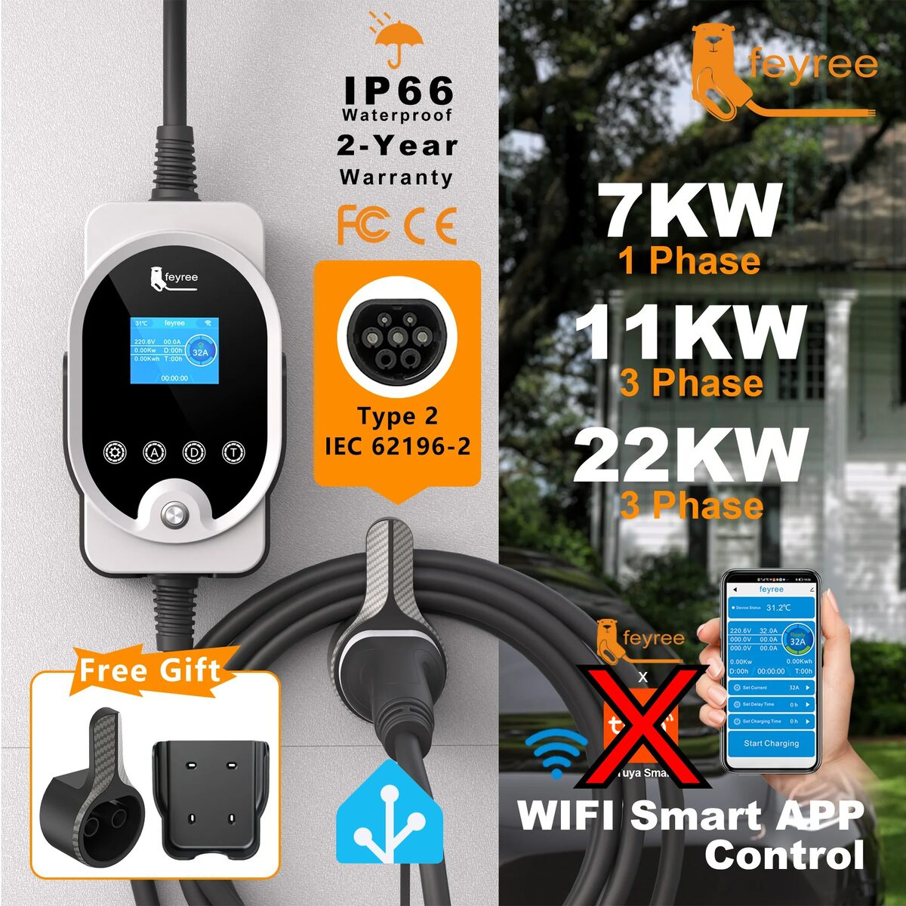
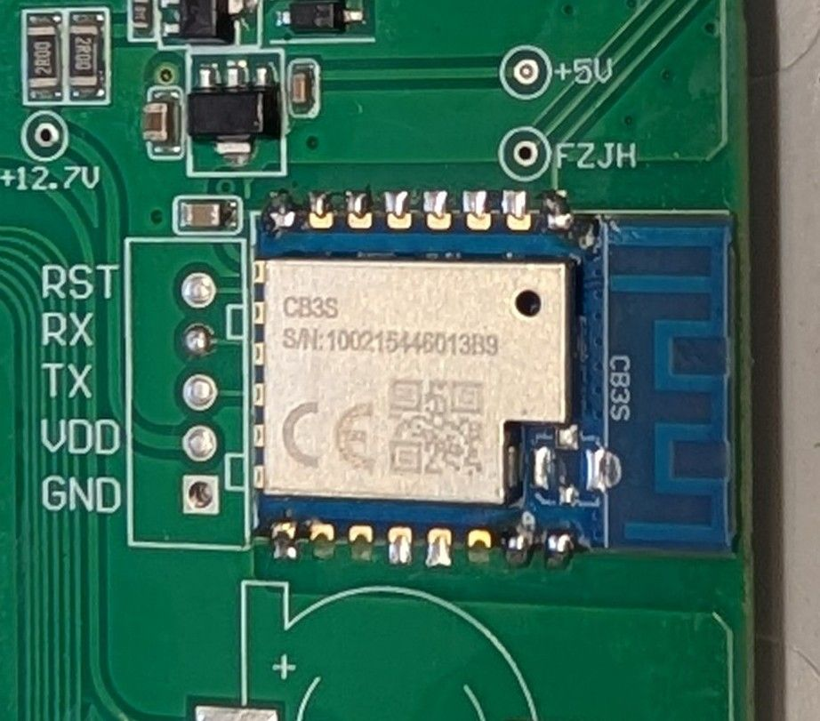
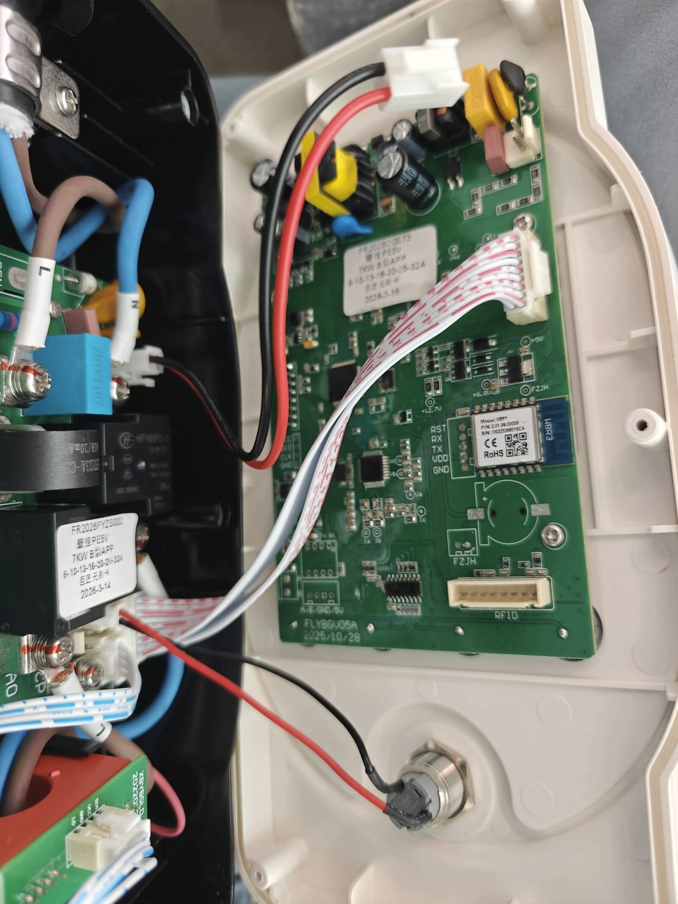
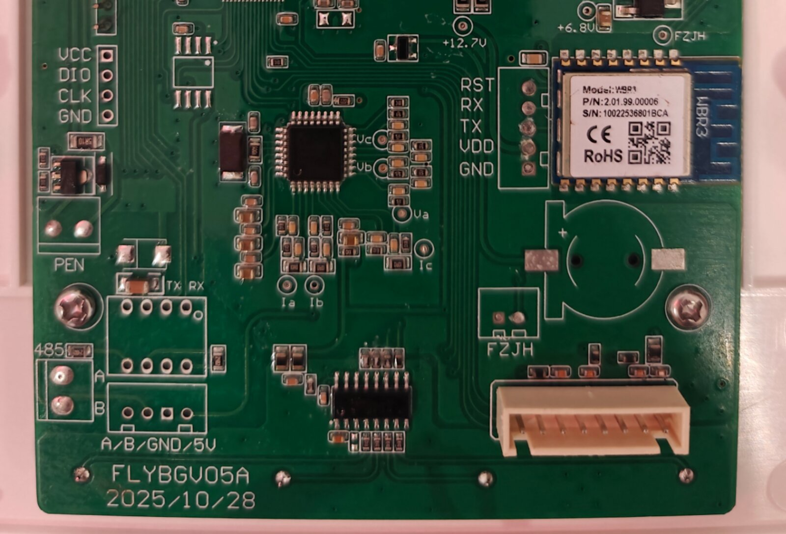
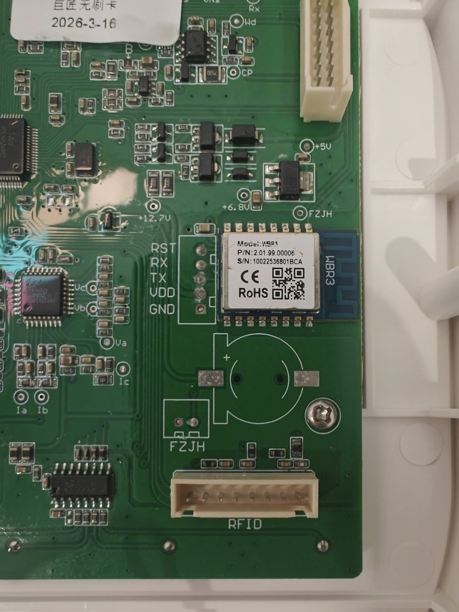
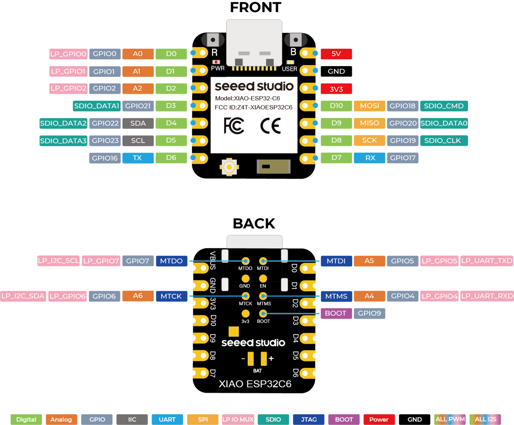
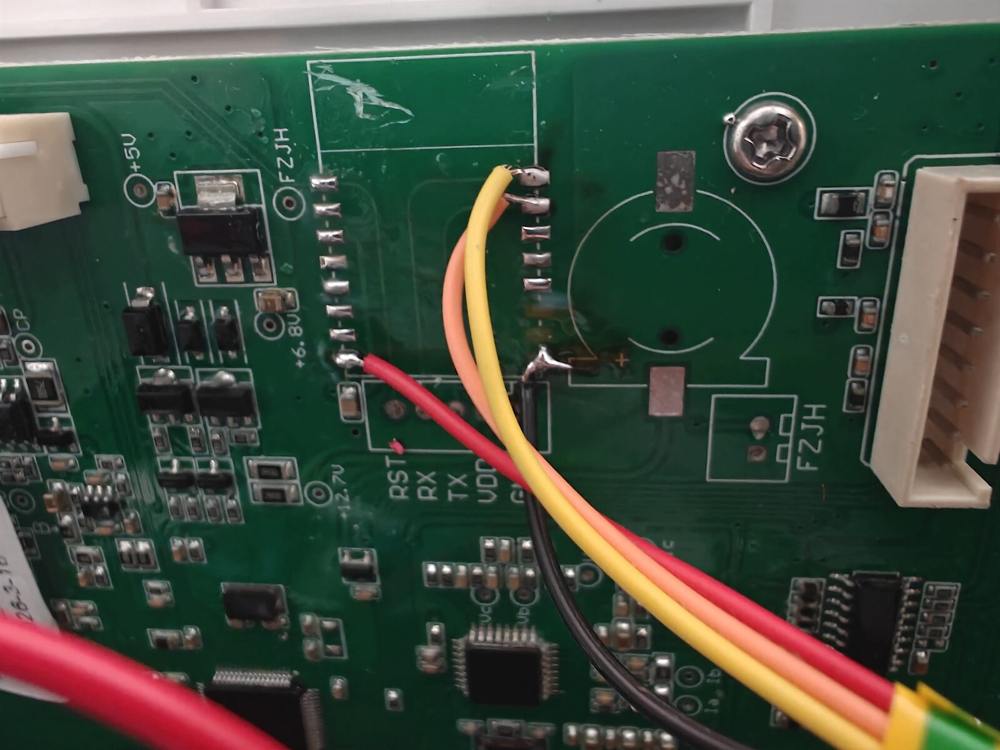
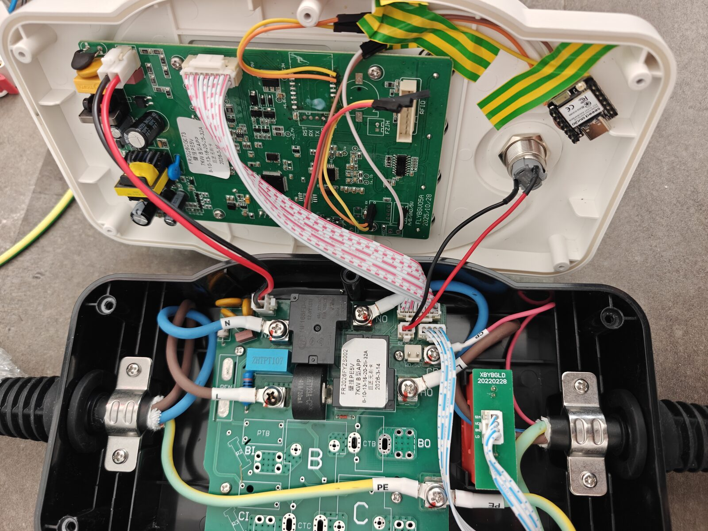

# Feyree cargador VE (wallbox, 7 kW) — ESPHome con XIAO ESP32-C6

[🇬🇧 English version](README.md)



Integración **100% local** del cargador wallbox Feyree (Tuya, monofásico 32 A / 7 kW) en
Home Assistant, sustituyendo el módulo WiFi **WBR3** (Realtek RTL8720CF, no flasheable
soldado en placa) por un **Seeed Studio XIAO ESP32-C6** con ESPHome. El ESP32 habla con el
MCU principal del cargador (GigaDevice **GD32F303**) mediante el protocolo **TuyaMCU**
(UART, 9600 baudios).

## MCU vs módulo WiFi — por qué funciona esto

El cargador tiene en realidad **dos "cerebros"**:

| Chip | Papel |
|---|---|
| **GD32F303** (MCU principal) | Hace *todo* el trabajo real: contactor, señalización CP/proximidad, medición, pantalla, RFID, protecciones. Habla un protocolo serie sencillo (TuyaMCU) y **no necesita ninguna nube**. |
| **WBR3** (módulo WiFi) | Es solo un **puente serie↔nube**: reenvía los datapoints del MCU a la nube de Tuya y viceversa. No aporta nada a la lógica de carga. |

Así que sustituir el módulo WiFi por un ESP32 con ESPHome da control local total
**sin tocar en absoluto la electrónica de potencia**. El cargador sigue funcionando
exactamente igual (pantalla, RFID, protecciones); solo deja de depender de la nube de Tuya.

### Por qué sustituir el WBR3 en vez de flashearlo

- El WBR3 (Realtek RTL8720CF) **no está entre los chips soportados oficialmente por
  ESPHome** (la documentación solo lista RTL8710BN/BX para Realtek; LibreTiny sí incluye
  una definición de placa WBR3, pero el soporte del RTL8720CF es parcial/experimental).
  En OpenBeken también es experimental.
- Y de todas formas **no se puede flashear soldado** — el pin de strap de descarga (PA00)
  y el RX de la UART de log (PA15) son pads en la *cara inferior* del módulo. Hay que
  desoldarlo sí o sí.
- La comunidad documentó el cambio por un **CB3S** (Beken), bien soportado y con la UART
  TuyaMCU en los mismos pads del footprint. Ya que desoldar es inevitable en ambos casos,
  un ESP32 me pareció mejor opción: ESPHome maduro, componente TuyaMCU nativo y OTA. La
  pega fue rehacer parte del trabajo de adaptación (cableado/YAML) que la comunidad ya
  había hecho para el Beken.
- Si prefieres esa ruta, también se incluye un YAML para CB3S
  ([`feyree-cb3s.yaml`](feyree-cb3s.yaml)).



## Hardware

| Elemento | Detalle |
|---|---|
| Cargador | Feyree wallbox 7 kW (Tuya, app Smart Life), monofásico 32 A |
| MCU principal | GigaDevice **GD32F303** (TuyaMCU, 9600 8N1) |
| Módulo WiFi original | **WBR3** (Realtek RTL8720CF) — retirado |
| Módulo nuevo | **Seeed XIAO ESP32-C6** (`seeed_xiao_esp32c6`, framework **esp-idf**) |



### Cableado XIAO ESP32-C6 ↔ placa Feyree

La UART TuyaMCU está en los **pads 15/16** del footprint del módulo WiFi (confirmado con el
esquema de aplicación oficial del datasheet Tuya del WBR3: pin 16 = TXD, pin 15 = RXD). Esa
misma UART está expuesta en el **header de 5 pines RST/RX/TX/VDD/GND** junto al footprint,
mucho más cómodo de soldar.







| XIAO C6 | Placa Feyree | Función |
|---|---|---|
| D6 = **GPIO16 (TX)** | **RX** del header (línea del pad 16) | TuyaMCU TX |
| D7 = **GPIO17 (RX)** | **TX** del header (línea del pad 15) | TuyaMCU RX |
| **5V** | **5V** del footprint `A/B/GND/5V` (zona RS485, sin poblar) | Alimentación |
| GND | GND (cualquiera, todas las masas son comunes) | Masa |

Notas:

- **Las revisiones de placa difieren.** En nuestra placa vieja la UART del header iba
  *directa*; en la nueva (PCB `FLYBGU05A 2025/10/28`) va **cruzada** (D6→RX, D7→TX). La
  serigrafía depende de la revisión. Si ves `Initialization failed at init_state 0` en
  bucle, intercambia los dos hilos — a 3,3 V es inofensivo.
- **Los test points TX/RX de la zona RS485 NO son la UART TuyaMCU** — son otra UART del
  GD32 (la del bus Modbus/RS485, con el transceiver sin poblar). Verificado con continuidad:
  no pitan contra los pads 15/16. Ahí nunca habrá handshake.
- Alimenta el C6 desde el **footprint 5V** (el XIAO regula internamente a 3,3 V). **No**
  uses el pin VDD del header (no da corriente usable — la pantalla parpadea) y mide antes
  el rail 3V3 con un multímetro: el nuestro estaba muerto (1,2 V). Vale cualquier GND.
- **Suelda los cuatro hilos.** Los dupont sueltos nos causaron días de tramas UART
  corruptas (~2% de errores de checksum) y comandos ignorados.


- La UART TuyaMCU es la **UART0 hardware** del C6 (GPIO16/17). El logger va por el USB
  nativo (`USB_SERIAL_JTAG`), así que no pisa la UART0.
- **No conectes USB y alimentación de la placa a la vez** si tienes dudas de aislamiento.
- Si un CB3S (o el WBR3) sigue en el footprint sin alimentar, cuelga de las líneas UART y
  las degrada. Fuera.

## Mapa de dpIDs (TuyaMCU)

Factores de escala confirmados por el teardown de *stonacek* en Elektroda (ver Referencias):

| dpID | Tipo | Descripción | Factor | Notas |
|---|---|---|---|---|
| 14 | enum | Modo de trabajo | — | 0=Carga inmediata, 1=Porcentaje, 2=Por energía, 3=Programado |
| 18 | bool | Enable general de carga | — | Interruptor maestro |
| 102 | value | Voltaje L1 | ×0.1 | V |
| 105 | value | Corriente L1 | **×0.1** | A (raw en décimas; **no** ×0.01) |
| 109 | value | Potencia | ×0.1 | kW |
| 110 | value | Temperatura | ×0.1 | °C |
| 112 | value | Energía de sesión | ×0.1 | kWh, se resetea por sesión (sin `state_class`) |
| 115 | value | Corriente objetivo de carga | — | A (6–32, number) |
| 124 | enum | Comando/estado de carga | — | 0=Cargar, 1=Parar, 2=Listo, 3=Esperando |

### Iniciar una carga real

El switch dpID 18 **no basta** por sí solo. Secuencia confirmada:

1. `dpID 14 = 0` (charge now) — anula timers/programaciones.
2. `dpID 124 = 1` (Stop) — limpia la sesión anterior.
3. `dpID 124 = 0` (Charge) — inicia la carga.

### ⚠️ La corriente NO se puede cambiar en caliente

Según el manual oficial de Feyree, la corriente (dpID 115) **solo se puede ajustar antes de
iniciar la carga**. Cambiarla durante una sesión activa provoca error "Over Current" y
detiene la carga (reportado también en tuya-local). Para carga solar dinámica / balanceo de
carga, el patrón seguro es:

1. `dpID 124 = 1` (Parar)
2. `dpID 115 = <nueva corriente>`
3. `dpID 124 = 0` (Cargar)

El coche tolera esta pausa (equivale a desenchufar y reenchufar). El dpID 124 sí funciona en
cualquier momento, y cambios pequeños en **pasos de 2 A** están reportados como viables en
caliente.

## Firmware

- **YAML principal**: [`feyree-c6.yaml`](feyree-c6.yaml) (XIAO ESP32-C6, recomendado).
- **Alternativa**: [`feyree-cb3s.yaml`](feyree-cb3s.yaml) (módulo Beken CB3S en el footprint del WBR3).
- **Ejemplo de automatización HA**: [`ha-carga-solar-ejemplo.yaml`](ha-carga-solar-ejemplo.yaml) —
  carga solar dinámica por excedente (parar → fijar corriente → cargar, pasos de 2 A,
  histéresis, cooldown). Los entity_ids son de ejemplo; los tuyos llevarán sufijo MAC.
- `secrets.yaml` contiene **solo** `wifi_ssid` / `wifi_password` (ver
  [`secrets.yaml.example`](secrets.yaml.example)). LAN de confianza: sin contraseña web, sin
  cifrado de API, sin contraseña OTA.

Detalles de la config:

- `name_add_mac_suffix: true` → hostname único tipo `feyree-c6-9f519c.local`.
- `web_server:` habilitado (puerto 80) para control/diagnóstico sin Home Assistant.
- `captive_portal` + AP de fallback abierto para recuperación si falla el WiFi.
- Sensores con `device_class`/`state_class` correctos. Energía sesión (112) **sin**
  `state_class` porque se resetea en cada sesión.
- En ESPHome, los select Tuya usan **`enum_datapoint`** (no `select_datapoint`).

## Flasheo

### Compilar

```bash
# OJO: compilar desde una ruta SIN espacios (esphome falla con rutas tipo "Mi Nube")
mkdir -p /tmp/esphome_feyree_c6
cp feyree-c6.yaml secrets.yaml /tmp/esphome_feyree_c6/
esphome compile /tmp/esphome_feyree_c6/feyree-c6.yaml
```

El binario queda en
`/tmp/esphome_feyree_c6/.esphome/build/feyree-c6/.pioenvs/feyree-c6/firmware.factory.bin`
(también `firmware.ota.bin` para actualizaciones OTA posteriores).

### Primer flasheo por USB-C

1. Modo download: **mantener BOOT mientras se enchufa el USB-C**
   (o BOOT + pulsar RESET). Aparece como `/dev/ttyACM0`
   (`303a:1001 Espressif USB JTAG/serial debug unit`).
2. Flashear a offset `0x0`:

```bash
esptool --chip esp32c6 --port /dev/ttyACM0 write-flash 0x0 firmware.factory.bin
```

3. Al arrancar conecta al WiFi y queda accesible en `http://feyree-c6-<mac6>.local`.

### Actualizaciones OTA

```bash
esphome run /tmp/esphome_feyree_c6/feyree-c6.yaml --device feyree-c6-<mac6>.local
```

## Estado verificado (26-Jul-2026)

- [x] Compila OK (ESPHome 2026.5.3, esp-idf).
- [x] Flasheado por USB-C; WiFi + mDNS + web_server OK.
- [x] Handshake TuyaMCU con el GD32 — dpIDs limpios, sin errores de checksum.
- [x] Monitorización en vivo (voltaje, corriente, potencia, temperatura, energía sesión, estado).
- [x] **Control de corriente**: `Setting datapoint 115` confirmado por el GD32 y **reflejado
  en la pantalla del propio cargador** (probado 16→21→10 A).
- [ ] Secuencia completa arranque/parada de carga (14/124) con coche enchufado.
- [ ] Carga solar dinámica por excedente en producción.

Proyecto actualmente **en pausa** (mudanza); el cargador está montado y esperando.



## Diagnóstico rápido

| Síntoma | Causa probable | Acción |
|---|---|---|
| `Initialization failed at init_state 0` en bucle | RX/TX al revés, UART equivocada, o módulo zombie en el footprint | Cruzar los hilos; usar el header, no los test points RS485; quitar el módulo viejo |
| Aparece 1 s en HA y cae | Brownout por picos WiFi (rail débil / contacto flojo) | Alimentar por el footprint 5V; revisar soldaduras |
| LED parpadea, no fijo, offline | Boot loop por alimentación inestable (dupont) | Medir 5V/GND **en los pads del propio C6** |
| Ping OK pero HTTP 000 | web_server colgado tras un arranque sucio | Ciclo de alimentación del C6 |
| Sensores llegan pero comandos no | Tramas corruptas (en nuestro caso: duponts) | Soldar los hilos, cortos |
| Log en vivo sin PC | — | `curl -sN http://<ip>/events` (log SSE del web_server) |

## Lecciones aprendidas

- **Los dupont son una lotería. Soldar siempre** en montajes definitivos. Fueron la causa
  probable de todos los fallos de control que perseguimos durante un día entero.
- Un rail a **1,2 V deja arrancar al chip pero no lo mantiene** (brownout WiFi). Medir el
  rail *antes* de culpar al firmware.
- ¿"No aparece en la red"? Alimentar por USB con el cargador desenchufado — separa fallos
  de firmware/WiFi de fallos de alimentación.
- Un resbalón midiendo 230 V mató un multímetro y (casi seguro) el LDO de 3V3 de la placa.
  El cargador sobrevivió. **La tensión de red no perdona: si no tienes seguridad sondeando
  una placa enchufada, no lo hagas.**
- Que el GD32 no reporte espontáneamente los dpIDs de control (115/14/124/18) es **normal**
  en reposo; pero tras un comando válido *debe* confirmar (`Datapoint 115 update`). Si no
  confirma nunca = cableado corrupto.

## Seguridad

Este aparato contiene **tensión de red (230 V)**. Todo lo descrito aquí es trabajo en baja
tensión (3,3/5 V), pero la placa de alrededor está viva cuando está enchufada. Desconecta la
red antes de soldar, verifica con multímetro, y nunca sondees placas enchufadas si no sabes
exactamente lo que estás haciendo.

## Respaldo del firmware original

Este proyecto **no flashea el WBR3** — simplemente se desuelda y se sustituye. Eso significa
que no hace falta ningún respaldo: el firmware Tuya original queda intacto en el módulo
retirado. **Recomendación: guarda el WBR3 desoldado en lugar seguro — ese módulo *es* tu
restauración de fábrica.** Lo vuelves a soldar y el cargador queda 100% de serie.

Si aun así quieres un respaldo en fichero, hazlo antes de desoldar (en realidad los pads de
strap/log están en la cara inferior, así que el volcado también exige quitar el módulo):
`ltchiptool flash read ambz2 wbr3_backup.bin -d /dev/ttyUSB0` (debe ocupar exactamente 2 MiB).

## Referencias

- **Teardown Feyree (stonacek, Elektroda)** — mapa dpIDs, factores, secuencia de carga:
  https://www.elektroda.com/rtvforum/topic4085036.html
- **Esquema oficial Tuya WBR3 MCU serial** (UART del MCU en pads 15/16):
  https://developer.tuya.com/en/docs/iot/wbr3-module-mcu-serial-communication-instructions?id=K9pfgdk62ae6g
- **ESPHome TuyaMCU**: https://esphome.io/components/tuya.html
- **ESPHome Tuya select**: https://esphome.io/components/select/tuya.html
- **Wiki Seeed XIAO ESP32-C6 / pinout**: https://wiki.seeedstudio.com/XIAO_ESP32C6_Getting_Started/
- **LibreTiny docs (por qué el WBR3 no es viable)**: https://docs.libretiny.eu/
- **Hilo HA Community — Feyree WiFi smart EV charger**:
  https://community.home-assistant.io/t/feyree-wifi-smart-ev-charger/718634
- Componentes comunitarios ESPHome Feyree (no usados aquí; YAML propio):
  https://github.com/vm03/esphome-feyree-ev-charger ·
  https://github.com/m-przybylski/esphome-feyree-ev-charger

## Licencia

AGPL-3.0 — libre para usar, modificar y compartir bajo los mismos términos.
